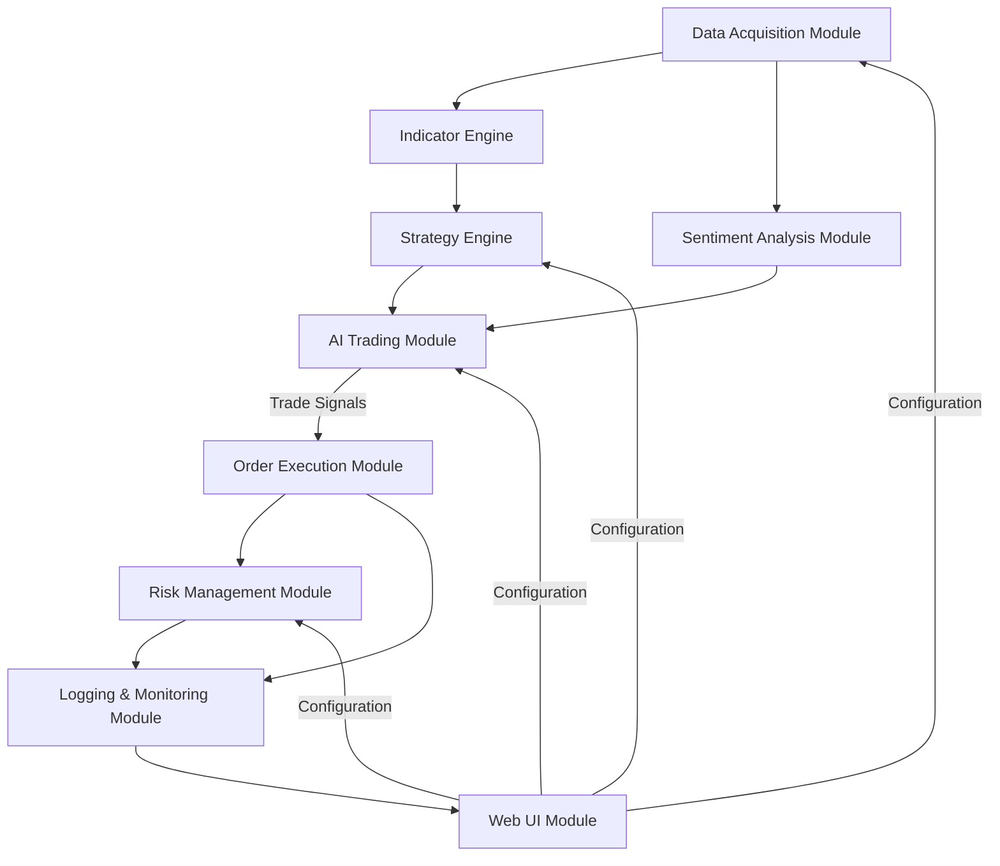

# Cryptocurrency High Frequency Trading Bot Specification

## Table of Contents
1. [Introduction](#introduction)
2. [Objectives](#objectives)
3. [System Architecture Overview](#system-architecture-overview)
4. [Module Descriptions](#module-descriptions)
   - [Data Acquisition Module](#data-acquisition-module)
   - [Indicator Engine](#indicator-engine)
   - [Strategy Engine](#strategy-engine)
   - [AI Trading Module](#ai-trading-module)
   - [Sentiment Analysis Module](#sentiment-analysis-module)
   - [Order Execution Module](#order-execution-module)
   - [Risk Management Module](#risk-management-module)
   - [Logging & Monitoring Module](#logging--monitoring-module)
   - [Web UI Module](#web-ui-module)
5. [Technology Stack](#technology-stack)
6. [Directory Structure](#directory-structure)
7. [Performance, Scalability & Security](#performance-scalability--security)
8. [Implementation Roadmap](#implementation-roadmap)
9. [Future Enhancements](#future-enhancements)

## Introduction

This HFT crypto trading bot is engineered to operate in the dynamic, 24/7 cryptocurrency markets. Its main functions include:
- **Rapid Data Retrieval:** Fetching real-time candlestick and order book data via exchange APIs and WebSockets with sub-50ms latency
- **Indicator Analysis:** Utilizing pre-built technical indicator packages to compute high-frequency trading indicators
- **Strategy Execution:** Supporting multiple configurable strategies to decide on trade entries and exits
- **AI Trading:** Autonomously executing trades based on technical indicators and sentiment analysis
- **Sentiment Analysis:** Monitoring social media, news, and forums for market-moving information
- **Web UI:** Providing a responsive dashboard for configuration, monitoring, and control

## Objectives

- **Ultra-Low Latency:** Achieve <50ms round-trip for data retrieval and <100ms for order execution
- **Modular & Extensible:** Allow seamless addition or modification of strategies and indicators
- **Pre-Built Indicators:** Leverage comprehensive libraries (TA-Lib/pandas-ta) for fast-moving indicators
- **AI-Driven Trading:** Use machine learning to execute trades based on technical and sentiment signals
- **Social Sentiment Integration:** Incorporate social media trends and news sentiment into trading decisions
- **Interactive Web Interface:** Provide real-time visualization and control through a responsive web UI
- **Robust Risk Management:** Implement strict risk controls including stop-losses, position sizing, and exposure limits

## System Architecture Overview

The bot is structured as a collection of loosely coupled modules:



## Module Descriptions

### Data Acquisition Module

**Functionality:**
- Connects to multiple cryptocurrency exchanges (Binance, Coinbase, FTX, Kraken) via REST APIs and WebSockets
- Retrieves real-time data: candlestick (OHLCV), order books (L2, minimum 10 levels), trade executions, tick data

**Implementation Considerations:**
- Asynchronous programming (Python's asyncio and websockets) for minimal latency
- Reconnection logic and redundant data feeds for high reliability
- Normalize data across exchanges for uniform processing

**Performance Requirements:**
- <50ms round-trip latency for data retrieval
- Support for multiple simultaneous exchange connections

### Indicator Engine

**Functionality:**
- Computes technical indicators from live data using pre-built libraries (TA-Lib or pandas-ta)

**Key HFT Indicators:**

1. **Momentum-Based**:
   - RSI with short periods (2-9)
   - CCI (Commodity Channel Index) with 5-period setting
   - Stochastic Fast (3,2) for rapid momentum shifts
   - Williams %R (lookback period: 3-5)
   
2. **Volume-Based**:
   - OBV (On-Balance Volume)
   - VWAP (Volume-Weighted Average Price) calculated intraday
   - MFI (Money Flow Index) with shortened periods (5-7)
   
3. **Volatility & Price Action**:
   - Bollinger Bands (10,1.5) - shorter periods with tighter bands
   - Keltner Channels (10,1)
   - ATR (Average True Range) for volatility measurement (period: 5)
   
4. **Market Microstructure**:
   - Order book imbalance ratio
   - Trade flow imbalance
   - Bid-Ask spread analysis
   - VPIN (Volume-Synchronized Probability of Informed Trading)

**Customization:**
- Allow indicators to be configured per strategy (thresholds, periods)
- Signal generation latency: <20ms

### Strategy Engine

**Functionality:**
- Combines indicator signals into actionable trade strategies
- Supports multiple strategy types:
  - Scalping (ultra-short timeframe)
  - Market making
  - Statistical arbitrage
  - Order book imbalance
  - Momentum riding
  - Mean reversion

**Features:**
- Strategy Interface: Abstract class for all strategy implementations
- Configurable rules and parameters via JSON/YAML configuration files
- Backtest Module: For historical performance evaluation with tick data
- Parameter Sets: Configurable for each strategy

### AI Trading Module

**Functionality:**
- Autonomously executes trades based on technical indicators and sentiment analysis
- Continuously learns from trading outcomes to improve decision-making

**Features:**
- Real-time Performance Monitoring:
  - Track all indicators and their signal accuracy
  - Measure strategy performance metrics (Sharpe, Sortino, win rate)
  - Monitor execution slippage and latency

- Machine Learning Components:
  - Reinforcement learning module for trade execution
  - Deep learning models for price prediction
  - Pattern recognition for market regime detection
  - Adaptive parameter tuning based on recent performance
  - Anomaly detection for market condition shifts
  - Integration of sentiment signals with technical indicators

- Decision Engine:
  - Multi-factor scoring system for trade signals
  - Dynamic threshold adjustment based on volatility
  - Risk-adjusted position sizing
  - Circuit breakers for unusual market conditions

### Sentiment Analysis Module

**Functionality:**
- Monitors social media platforms (Twitter, Reddit, Discord, Telegram)
- Analyzes news sources and financial publications
- Tracks influencer accounts and whale wallets
- Measures overall market sentiment and coin-specific sentiment

**Features:**
- Data Collection:
  - API connections to social platforms
  - Web scraping of news sites and forums
  - Whale wallet tracking via blockchain explorers

- Analysis Techniques:
  - Natural Language Processing (NLP) for text analysis
  - Sentiment scoring (positive/negative/neutral)
  - Topic modeling to identify trending discussions
  - Entity recognition for coin and project mentions
  - Volume analysis of mentions over time

- Storage and Integration:
  - Real-time sentiment scores stored in database
  - Historical sentiment data for backtesting
  - Sentiment signals fed to AI Trading Module
  - Correlation analysis between sentiment and price movements

### Order Execution Module

**Functionality:**
- Executes trades via exchange APIs with low latency
- Supports various order types:
  - Limit orders (primary)
  - IOC (Immediate-or-Cancel)
  - FOK (Fill-or-Kill)
  - Post-only orders

**Features:**
- Smart Routing:
  - Dynamic fee analysis for optimal exchange selection
  - Liquidity-aware order placement
  - Iceberg/hidden order capability

**Implementation Considerations:**
- Robust error handling and confirmation mechanisms
- Persistent connection for rapid order routing
- Order execution latency: <100ms
- Maximum throughput: 100+ orders per second

### Risk Management Module

**Functionality:**
- Enforces risk controls such as stop-loss, take-profit, and position sizing rules
- Monitors overall exposure and market volatility in real time

**Features:**
- Per-trade maximum loss
- Maximum drawdown thresholds
- Position sizing based on volatility
- Exposure limits per asset and overall portfolio
- Dynamic adjustment of risk parameters based on market conditions
- Automated alerts for risk threshold breaches

### Logging & Monitoring Module

**Functionality:**
- Logs incoming data, indicator outputs, trade decisions, and execution results
- Provides data for the Web UI dashboard

**Features:**
- Historical data storage (PostgreSQL or time-series database)
- Error and performance analytics for continuous system improvement
- Prometheus and Grafana for monitoring
- 99.9% uptime monitoring

### Web UI Module

**Functionality:**
- Provides a browser-based interface for configuration, monitoring, and control
- Visualizes real-time trading data and performance metrics

**Features:**
- Dashboard:
  - Real-time trading performance (PnL, win rate, drawdown)
  - Active positions and orders
  - Technical indicator visualizations
  - Sentiment analysis results
  - System health metrics

- Configuration:
  - Strategy selection and parameter tuning
  - Risk management settings
  - Exchange API management
  - Sentiment source configuration

- Controls:
  - Start/stop trading
  - Emergency position liquidation
  - Manual trade execution
  - Indicator and strategy testing

**Implementation:**
- Responsive design for desktop and mobile
- Real-time updates via WebSockets
- Secure authentication and authorization
- Role-based access control

## Technology Stack

- **Backend**:
  - Python 3.10+ (core) with Rust/C++ for critical components
  - FastAPI for REST API endpoints
  - WebSockets for real-time data streaming

- **Frontend**:
  - React.js for UI components
  - TailwindCSS for styling
  - D3.js for advanced visualizations
  - Redux for state management

- **Libraries**:
  - `ccxt` for exchange API integration
  - `websockets` for data streaming
  - `pandas-ta` or `ta-lib` for technical indicators
  - `numpy` for numerical operations
  - `scikit-learn` and `tensorflow` for ML components
  - `transformers` for NLP sentiment analysis
  - `redis` for high-speed data caching
  - `postgresql` for historical data storage
  - `timescaledb` for time-series data
  
- **Deployment**:
  - Dedicated servers in proximity to exchange servers
  - Multi-region failover capability
  - Kubernetes for orchestration
  - Containerization with Docker

## Directory Structure

```
crypto-hft-bot/
├── .github/                      # GitHub workflows and configuration
├── docs/                         # Documentation
├── src/                          # Source code
│   ├── data_acquisition/         # Data retrieval components
│   │   ├── exchange_connectors/  # Exchange API clients
│   │   ├── websocket_handlers/   # WebSocket connection managers
│   │   └── data_normalizers/     # Data format standardization
│   │
│   ├── indicators/               # Technical indicator components
│   │   ├── momentum/             # Momentum indicators
│   │   ├── volume/               # Volume indicators
│   │   ├── volatility/           # Volatility indicators
│   │   └── microstructure/       # Market microstructure indicators
│   │
│   ├── strategies/               # Trading strategy components
│   │   ├── base/                 # Strategy interface definitions
│   │   ├── scalping/             # Scalping strategies
│   │   ├── market_making/        # Market making strategies
│   │   └── arbitrage/            # Arbitrage strategies
│   │
│   ├── ai_trading/               # AI trading components
│   │   ├── models/               # Machine learning models
│   │   ├── training/             # Model training utilities
│   │   ├── prediction/           # Prediction services
│   │   └── optimization/         # Parameter optimization
│   │
│   ├── sentiment_analysis/       # Sentiment analysis components
│   │   ├── data_collectors/      # Social media API clients
│   │   ├── nlp_processors/       # Text analysis components
│   │   ├── scoring/              # Sentiment scoring algorithms
│   │   └── storage/              # Sentiment data persistence
│   │
│   ├── execution/                # Order execution components
│   │   ├── order_types/          # Order type implementations
│   │   ├── smart_routing/        # Exchange selection logic
│   │   └── confirmation/         # Order confirmation handlers
│   │
│   ├── risk_management/          # Risk management components
│   │   ├── limits/               # Risk limit implementations
│   │   ├── position_sizing/      # Position sizing algorithms
│   │   └── alerts/               # Risk alert system
│   │
│   ├── logging/                  # Logging and monitoring
│   │   ├── loggers/              # Custom logging implementations
│   │   ├── metrics/              # Performance metrics collection
│   │   └── storage/              # Log storage and rotation
│   │
│   └── web_ui/                   # Web interface
│       ├── backend/              # API endpoints for UI
│       │   ├── routes/           # API route definitions
│       │   ├── services/         # Business logic for UI
│       │   └── auth/             # Authentication and authorization
│       │
│       └── frontend/             # React frontend
│           ├── components/       # UI components
│           ├── pages/            # Page definitions
│           ├── state/            # Redux state management
│           └── assets/           # Static assets
│
├── config/                       # Configuration files
│   ├── exchanges/                # Exchange connection parameters
│   ├── strategies/               # Strategy parameters
│   ├── indicators/               # Indicator parameters
│   ├── risk/                     # Risk management parameters
│   └── sentiment/                # Sentiment analysis parameters
│
├── tests/                        # Test suites
│   ├── unit/                     # Unit tests
│   ├── integration/              # Integration tests
│   └── e2e/                      # End-to-end tests
│
├── scripts/                      # Utility scripts
│   ├── setup/                    # Installation scripts
│   ├── backtest/                 # Backtesting utilities
│   └── deployment/               # Deployment scripts
│
├── data/                         # Data storage
│   ├── historical/               # Historical market data
│   ├── sentiment/                # Sentiment analysis data
│   └── logs/                     # Application logs
│
├── docker/                       # Docker configuration
│   ├── dev/                      # Development environment
│   └── prod/                     # Production environment
│
├── .env.example                  # Environment variable template
├── docker-compose.yml            # Docker Compose configuration
├── requirements.txt              # Python dependencies
├── README.md                     # Project overview
└── LICENSE                       # License information
```

## Performance, Scalability & Security

### Performance
- Leverage asynchronous programming and optimized libraries for millisecond-level latency
- Use vectorized computations for indicator calculations
- Ensure order execution latency <100ms and signal generation latency <20ms

### Scalability
- Modular architecture to add new exchanges, indicators, and strategies
- Horizontal scaling by distributing data acquisition and order execution across multiple nodes
- Separate services for sentiment analysis to handle large volumes of social data

### Security
- Secure storage of API keys and credentials (e.g., AWS Secrets Manager)
- Encrypted communications (TLS) with exchanges and web UI
- API key rotation schedule
- IP whitelisting for all exchange connections
- Rate limit management
- Trade journal for regulatory compliance
- Audit logging for all system actions
- Role-based access control for web UI

## Implementation Roadmap
1. Data acquisition system (2 weeks)
2. Technical indicator engine (2 weeks)
3. Strategy framework and initial strategies (3 weeks)
4. Core AI trading functionality (3 weeks)
5. Sentiment analysis base implementation (3 weeks)
6. Execution engine (2 weeks)
7. Risk management module (2 weeks)
8. Logging & monitoring system (1 week)
9. Web UI development (4 weeks)
10. Integration and system testing (3 weeks)
11. Advanced AI models and optimization (4 weeks)
12. Advanced sentiment analysis features (3 weeks)

## Future Enhancements
1. Advanced AI trading strategies using deep reinforcement learning
2. Natural language generation for trading reports and insights
3. Support for decentralized exchanges (DEXs)
4. Integration with additional data sources (on-chain metrics, derivatives data)
5. Cross-exchange arbitrage capabilities
6. Expanded sentiment analysis for private forums and chat groups
7. Enhanced backtesting with market replay at tick level
8. Mobile application for monitoring and alerts
9. API access for third-party integration
10. Multi-asset portfolio optimization
